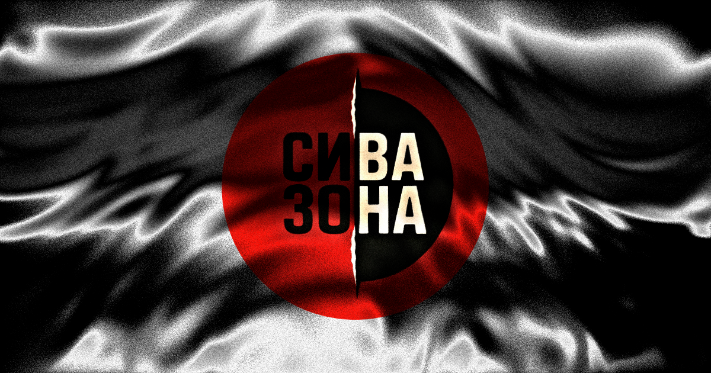

# Sivazona MK (Gray Zone)



Marketing site for **Сива Зона** aka **Gray Zone**, served at <https://siva-zona.ostaver.com>. Bilingual (Macedonian default, English under `/en`), single-page, with a WebGL hero and a preloader that transitions into it.

## Stack

- **Astro 7**, static output (`astro build` → `dist/`)
- **TypeScript** (strict, via `astro check`)
- **GSAP** (+ ScrollTrigger, SplitText, etc.) and **Lenis** for motion and smooth scroll
- **OGL** + custom GLSL for the hero field and preloader/seam effects
- Fonts via `@fontsource` (Inter Tight, JetBrains Mono, Oswald)
- Astro i18n routing: `mk` (default, no prefix) and `en` (`/en`)

Requires **Node >= 22.12**.

## Deployment

Static site deployed directly from the `dist/` directory; there is no server runtime or CI/CD pipeline.

- Build command: `npm run build`
- Output directory: `dist`
- Node version: 22+

Upload or serve the contents of `dist/` to any static web host.

`astro.config.mjs` currently uses `https://siva-zona.ostaver.com`, where this Astro site is deployed. `https://sivazona.mk` still serves the legacy site. Change `site` only when the deployment domain moves; canonical, language alternates, sharing images, sitemap and robots URLs follow it.

## Getting started

```bash
npm install
npm run dev
```

The dev server runs at <http://localhost:4321>.

| Command | What it does |
| --- | --- |
| `npm run dev` | Start the dev server |
| `npm run build` | Production build to `dist/` |
| `npm run preview` | Serve the production build locally |
| `npm run check` | Type-check Astro and TypeScript files |

## Project layout

```
src/
  pages/        Routes (index.astro = mk, en/index.astro = en)
  views/        Page-level compositions (HomePage.astro)
  layouts/      Base HTML shell
  components/   hero/, about/, story/, gallery/, tutorial/, team/, play/, contact/, shell/ (preloader, nav, footer), ui/
  data/         Content: team, play, gallery, funders, links, tutorial, about, contact; sections (page order)
  i18n/         Locale config and UI strings
  lib/          gl/ (WebGL stage, shaders), canvas/, motion/ (gsap, lenis), zone.ts (shared zone switch), lifecycle, og.ts (share-image variants)
  styles/       tokens.css, global.css, flap.css (split-flap boards)
  assets/       Optimised images (brand, gallery, team, tutorial per locale)
public/         Static files copied as-is (favicons, og-image.png)
```

## Zone appearance

The hero's **White zone** and **Black zone** labels and the nav's split-disc button are keyboard-accessible theme controls in both locales. White zone switches the page and download dialog to light surfaces with dark text, retaining the red CTA accents and red half of the WebGL dot field. The neutral half uses darker dots for contrast on white. Black zone restores the original dark/red palette. Both modes retain the cursor lens, moving seam, and chromatic split; only hovering the theme buttons pauses the seam's pointer target so they remain easy to click. The hero buttons expose the selection with `aria-pressed`; the nav disc is a toggle (`aria-pressed` = white zone) that turns over as the zone changes. The DOM shader fallback follows the same selection.

Hero theme buttons stay within the page gutters and use the shared 44px control-target token. Narrow layouts wrap their labels and omit the optional detected-OS suffix from the download button so it and the introductory copy fit. Compact heroes reflow instead of clipping content on very short screens; short landscapes place the controls beside the headline, clear of copy and navigation. Theme controls and the download action stay visible while the desktop headline scatters; only supporting copy fades (the description first, as the theme controls rise with the headline, no higher than the line it held under the bar). The nav toggle keeps a constant White-zone accessible name, with `aria-pressed` indicating that White zone is active; its visual tooltip names the next choice.

Black zone is the default for a new browser session. The selected zone is kept in session storage (`sz-zone`) and restored before paint, including when changing language. CSS palettes live in `src/styles/tokens.css`. Every control switches through `setZone` in `src/lib/zone.ts`, which runs the transition and notifies subscribers; `hero.ts` subscribes and passes the selection to the shader through `SeamHalftoneState.whiteZone`.

Theme changes bloom outward from the selected button over 1.3 seconds, with a soft halftone fringe and a subtle settling zoom. Native View Transitions reveal the new page palette without cloning its DOM or WebGL context; the shared stage redraws synchronously for capture. Browsers without the required snapshot/mask support get an expanding paper/ink veil with a red dot rim, then a fade to the live page. Reduced motion skips the effect. Theme controls retain keyboard focus and temporarily expose `aria-disabled` while switching; repeated selections do not restart the animation.

## Navigation

`src/components/shell/Nav.astro` (+ `nav.ts`) is a fixed bar: logo disc and wordmark (scrolling through the hero rolls the disc out to the full logo and slides the wordmark into it, where it hands over to the logo's own letters from `logoArt.ts`), the section links, the zone disc, the language switch and, once the hero's own download button has gone up under the bar, a compact download button that opens the download dialog (so the two are never on screen together). Where the hero isn't pinned (phones, short landscapes) the logo is fully merged by the time the headline, scrolling away, reaches the bar. The hidden header CTA is inert and becomes non-hit-testable immediately; theme and language controls stay above it throughout the slot transition.

- **Seam index (≥ 1180px).** A small copy of the hero's tear runs through the row of links. Links left of it are solid; links right of it stay gray. It follows the reader, passing through each section's link while that section is read, and reaches the end of the row at the bottom of the page. Hovering pulls it to the pointer and keyboard focus pulls it to the focused link. The current section's links get `aria-current`.
- **Menu (< 1180px).** The links move into a full-screen sheet slung in from the side with a torn leading edge; it shudders as it lands, and every link and detail inside arrives its own way (slung, hinged, slammed, flipped, sprung; labels scramble, contacts bounce), then scatters on close. It has hollow display type that tears solid on hover/focus and for the current section, plus language, contact, version and the download CTA. While it is open, the main content and footer are inert and scroll is locked; Escape closes it. On these layouts the bar hides while scrolling down and returns when scrolling up or receiving keyboard focus. Over the hero the logo stays to show its merge; past the hero it goes with the bar, so it never sits on the copy. Without JavaScript, or if the nav bundle fails, the real section/language/download links remain visible instead of a nonfunctional menu toggle.
- **Plate.** Over the hero the bar has no background of its own. Once the hero has passed, a blurred strip of the page surface with a torn edge slides in behind it.
- **Scroll rail.** On mouse-driven screens `src/components/shell/ScrollRail.astro` (+ `scrollRail.ts`, mounted in Base) replaces the system scrollbar with a ruler down the right edge: a mark per section, placed where the thumb stands as that section starts being read (the current one turns red and its number scrambles in), names on hover, and a square-cut red thumb that stretches and thins like liquid with the page's speed. Drag the thumb, click the track to jump, or click a mark to go to its section; it dims when idle. It is decoration (`aria-hidden`): keys, wheel and the nav do the real work. Touch screens keep the system's overlay scrollbar.

In-page links scroll with Lenis, update a shareable URL hash, and move focus to the target section. Back/forward and initial deep links restore the target after layout readiness. Language links preserve the section hash. Sections are listed once in `src/data/sections.ts` (ids = anchors = `ui.nav` keys), with Gallery first after the hero. The first-visit preloader (the logo assembling from halftone dots over a row of progress dots, no text; on the white zone it sits on lit paper with a soft warm-gray falloff, and its dots run nearly edge to edge with the disc's dark half in solid ink so the logo stays solid against the light ground) blocks background focus only until readiness; an inline fail-safe releases the page even if a bundle fails. Repeat visits and reduced motion skip it.

## About

`src/components/about/About.astro` (+ `about.ts`, `trade.ts`) follows the gameplay-first Gallery. Copy lives in `src/data/about.ts`, with aligned English and Macedonian explanations of the player, deadline, choices and educational use. The hero names the same four tracked values: integrity, reputation, time and money.

- **Manifesto.** A large statement read across the tear: each word is gray type with a solid copy that rips across it as the reader reaches it (scrubbed, transforms only, the menu's tear technique). Runs marked `hollow` stay hollow display type like the hero's gray half; `red` runs tear in integrity red.
- **Logo orb.** The logo disc printed in halftone dots by the shared WebGL stage (`src/lib/gl/views/logoOrb.ts`, `logo-orb.frag.glsl`, reusing the hero's noise field pass). The wordmark is drawn to a canvas texture once Oswald's Cyrillic subset has loaded, split across the tear like the logo, and the dark half is solid ink so it reads in both zones. The disc turns as its column scrolls by and dots swell under the pointer. On desktop it rides sticky beside the copy. Without WebGL the real logo image stands in.
- **Copy.** Title, paragraphs and goals print in through a halftone screen (`print()` in `src/lib/motion/reveal.ts`, mask on `[data-printing]` in `global.css`): a sweeping front with a dot fringe ahead of it. Goals are marked with small torn lines (`src/lib/torn.ts`).
- **The trade (stats).** A pinned scene with one viewport of scroll on desktop, drawn as one batch of dots (`src/lib/gl/views/dotBatch.ts`). Scrolling is a run of shortcuts: the gray zone eats the dot-matrix word INTEGRITY from the right, its dots tremble, break off and arc down into a growing heap of coins (money). Eyes open one by one, blink, and follow the front or your pointer (reputation); they are small SVGs over the stage (after an "eye alert" icon: an almond lid, an iris ring with a glint), squashed to open and blink with non-scaling strokes, so a shut eye is a slit. A flip-dot clock runs throughout and races when you scroll fast (time). Every chip's path is a pure function of scroll progress, so scrolling back reverses it. DOM text carries each stat's name and caption; without WebGL the word and clock are set as type.

Below 900px the trade follows normal vertical flow: the word on top, the clock and the money pile side by side under it (the pile on the right, so the chips fall into it without crossing any copy; the word's caption keeps to the left half), the eyes below. At every width each stat's art and caption share rows with its neighbours (subgrid), so the captions line up. Reduced motion shows the statement fully torn, the copy in place, and one still frame of the trade, unpinned.

## Story

`src/components/story/Story.astro` (+ `story.ts`) follows About, with no nav entry of its own (the seam index counts it as About). Copy and steps live in `src/data/story.ts`.

A pad of four forms in a 320svh desktop scene: birth certificate, the secretary's confirmation, the English test, the interview. Each form has an honest box and a shortcut box either side of a torn line (real radio inputs). Ticking one draws the tick and signs the form; a shortcut also blooms a gray halftone stain into the paper. Scrolling (or a pointer tick, which scrolls for you) tugs the top sheet and throws it off-screen, alternating sides. Keyboard focus reveals its corresponding form. Under the pad lies the scholarship decision: a summary of your four choices and the verdict on a split-flap board that clatters through letters and lands on the word, left to right, when the decision is uncovered (`src/lib/motion/flap.ts`). No shortcuts → approved, earned honestly; one or two → approved, with marks; three or more → rejected (`verdictFor`). Changing a tick on the way back up re-decides, and the board flips to the new verdict. On wide screens the column beside the pad holds the queue: the four counters, the current one lit, each marked honest or shortcut as it's ticked (as on the decision), and a deadline bar that runs down as the pad is scrolled. It repeats the forms, so it is hidden from assistive tech.

Below 900px and with reduced motion, the forms are a normal column with the decision last, its verdict board already landed and live. Without JS the forms still tick and stain (`:has()`), and the decision lists all three outcomes (the verdict word as a plain label).

## Gallery

`src/components/gallery/Gallery.astro` (+ `gallery.ts`) follows the Hero so visitors see actual gameplay before the manifesto. Screens and bilingual action captions live in `src/data/gallery.ts`: school, secretary, tasks, then menu, settings and nickname.

- **The arc (≥ 900px).** The screenshots hang on a gentle arc that loops, drawn by the shared WebGL stage (`src/lib/gl/views/arcGallery.ts`, `gallery.vert.glsl`, `gallery.frag.glsl`), after the "circular gallery" pattern: each screen is a flat quad tilted to follow the arc. The centred screen is full size and shown as is; the others are a little smaller, dimmer and less saturated. Corners are rounded and edges anti-aliased in the shader (the stage has no MSAA). The section pins; scrolling turns the arc one screen per quarter viewport, easing into each screen, and a horizontal drag turns it too (a flick carries on to the next screen). Whenever it comes to rest it settles on the nearest screen, whose caption and number show under it in HTML.
- **Cost.** Everything is placed in CSS px, so one mesh and one program draw every screen (one draw call each), and the view only asks the stage for frames while the arc moves or a screen is fading in; at rest it isn't redrawn. The arc's 1600px webp copies are the lightbox's images too, so each screenshot downloads once.
- **Lightbox.** Clicking a screen opens it full size in a dialog, thrown in like a sheet onto a desk: it flies in spinning from a random side, lands with a jolt and wobbles still while its caption scrambles in, then the arrows skid in from their edges and the close button drops in on a spring. Arrows, arrow keys and swipes page through, flinging the sheet off one side as the next lands from the other; closing tosses it away. Closing centres the screen you ended on.
- **Keyboard and assistive tech.** The real list of screens stays in the DOM, visually hidden while the arc is drawn: tabbing (or arrow keys) to a screen turns the arc to it and rings it; Enter opens it.

Below 900px, with reduced motion, or without WebGL: screenshots remain a normal grid and the JS lightbox still works. Live WebGL context loss disposes the stage and arc, stops their work and restores all six image links without pin spacing. Without JS, those links open the full-size images directly.

## Tutorial

`src/components/tutorial/Tutorial.astro` (+ `tutorial.ts`) follows About and Story. Steps, screens and copy live in `src/data/tutorial.ts` (screens per locale).

- **The ring (≥ 900px).** The step screens stand on a tilted 3D ring in plain CSS (`preserve-3d`, after the "round carousel" pattern; no WebGL), with each screen's back showing its number and name. It turns by itself: it holds on a step while that step's bar fills (6 s), then turns to the next. A drag spins it (a flick coasts on a step or more) and it settles on the nearest screen; clicking a screen, a step number or an arrow turns it there, and the reader's input holds off the autoplay for a while. Page scroll swings the ring a little with the flow and it springs back. Screens dim as they turn away from the front.
- **Copy.** The step facing front has its copy under the ring: the title scrambles into place over its own length, the paragraphs rise in. Every step's copy stays laid out in one shared cell (the others hidden), so the block is always as tall as the longest step and turning the ring never resizes the section or shifts the page; the phone carousel does the same. The ring sizes to the viewport's height as well as its width and the hint sits beside the title, so title, ring, controls and the longest step's copy fit one laptop screen (down to 1280×720).
- **Entrance.** The ring fans out of one stack as it comes on screen and spins round to step 1.
- **Pausing.** The play/pause button stops the autoplay; it also holds while the mouse is over the copy or keyboard focus is in the controls. Arrow keys page when focus is in the controls.
- **Phones and tablets (< 900px).** A flat manual carousel puts the original screenshot and explanation together, with no autoplay. Named steps and arrows have at least 44px targets; the step strip scrolls horizontally. Arrow keys, Home and End choose steps. Hints match the active ring/manual/static presentation.

Reduced motion or no JS: the steps are a plain list, screen beside copy.

## Team

`src/components/team/Team.astro` (+ `team.ts`) follows the Tutorial. Members, the photo and the section's copy live in `src/data/team.ts`.

- **Photo.** The team photo prints in with the section's title (the halftone sweep from `lib/motion/reveal.ts`), has a torn foot, and drifts slightly against the scroll. On wide screens it holds still on the left while the roster scrolls past.
- **Roster.** One line per member, like credits: number, name, role. As they scroll in, each rule draws across and its row is slung in from alternating sides.
- **Files.** Each member is a native `<details>`: it opens without JS. With it, opening a file unrolls it, the role decodes, the bio rises in, the localized tags (hairline pills with a red dot) float up one after another and the links slide in. One file is open at a time; opening another closes the last.

Reduced motion or no JS: the files open and close instantly.

## Play

`src/components/play/Play.astro` (+ `play.ts`) follows the Team: the closing call to play. Its copy lives in `src/data/play.ts`; download links and the version come from `src/data/links.ts`, and the platform strings from the download dialog's (`ui.download`). It is not in the nav (the nav's download button covers it), so it has no entry in `sections.ts`.

- **The pass.** A paper admission ticket into the gray zone (entry, admits one player, price: free, version, languages, a barcode). It feeds out of a slot in steps as the section scrolls in, scrubbed like a ticket printer, and drops onto a slight tilt once it's out; it is all the way out while the slot is still mid-screen, so the title and the whole ticket are seen together.
- **Stubs.** Each platform is a perforated stub on the ticket (beside it on wide screens, below it on narrow ones) and a real download link with its archive size. Hovering peels it off its perforation; clicking tears it off and lets it fall while the download starts, then a fresh stub prints back in. The reader's own platform, when it can be told, comes first and is marked. Phone and unsupported-platform detection is shared with the download dialog.

- **All releases.** A liquid-carve button (`src/components/ui/LiquidButton.astro` + `liquidButton.ts`, a vanilla port of Originkit's): a paper slab over a red pool, where a blob follows the pointer and carves through with gooey, speed-stretched edges. Keyboard focus carves its middle. It ticks only while the blob shows.

Reduced motion or no JS: the ticket is simply there and the stubs are plain links.

## Contact and footer

`src/components/contact/Contact.astro` (+ `contact.ts`) is the last section. Its copy (and the footer's) lives in `src/data/contact.ts`; the address, Instagram and repo come from `src/data/links.ts`.

- **Channels.** Email, Instagram, source code and public GitHub bug reports, each on its own ruled line with the value set large. Copy explains feedback, classroom use and collaboration, plus the details needed for a bug report and the warning not to post personal information; on tablets and small laptops it starts under the title where the values do; from 1200px it stands beside the title, on its baseline. On the way in the rules draw, the labels scramble on and each value rises out of a slot; on hover red ink rolls across the value and it scrambles back into itself. The address breaks at the @ on narrow screens.
- **Copy.** A button beside the address puts it on the clipboard; a split-flap board covers the button's face and clatters out "copied" before the button returns (announced through a live region). Without the clipboard API it is hidden and the mailto link is all there is.

`src/components/shell/Footer.astro` (+ `footer.ts`) sits after `#main` through Base's `footer` slot: the funders' logos (one image each, set at one height and evenly spaced) and the EU disclaimer on a strip of light paper torn along its top (`src/data/funders.ts`), a link block (the page's sections, the game: download, release notes, source, bug reports, Instagram, and the other language, kept on the same section hash), then the build-year rights line and the version (deliberately no back-to-top button; see AGENTS.md). Below that Gray Zone is set the width of the page, whole and uncut; its letters rise out of the floor one after another as the end of the page scrolls in.

Reduced motion or no JS: the channels and the name are simply there.

## Share image

`public/og-image.png` (1200×630) is the master and the default `og:image` / `twitter:image`. `src/pages/og-image.[ext].ts` encodes `/og-image.jpg` and `/og-image.webp` from it at build time (sharp), and `Base.astro` lists all three as `og:image` entries, JPEG first (the PNG is ~1MB, over what Instagram and WhatsApp fetch for a preview); `twitter:image` is the JPEG too. Replace only the PNG; the other formats follow on the next build.

## Search and missing pages

- **Structured data.** `Base.astro` describes the game as a schema.org `VideoGame` (free, Windows and macOS, both languages, version and download from `src/data/links.ts`) in a JSON-LD block on each language's page.
- **Sitemap and robots.** `src/pages/sitemap.xml.ts` lists both language versions, each with the other as its `hreflang` alternate; `src/pages/robots.txt.ts` allows everything and points at the sitemap. Both are built from `site` in `astro.config.mjs`.
- **Signature.** `OSTAVER: The intersection of Art and Abstract Expression` is a hidden source comment in Base and a comment in both `/robots.txt` and the requested `/robotx.txt`. `robotx.txt` is a signature file, not a replacement for the crawler-standard `robots.txt`.
- **404.** `src/pages/404.astro` builds `dist/404.html`, which Cloudflare serves for any missing path. A missing page can't tell which language the reader came in, so it carries both: a slip from the archive's counter with a two-line split-flap board hung on its corner that clatters out "not found" in each language, with a way back to each language's home (copy in `src/data/notFound.ts`). It is `noindex` (Base's `noindex` prop, which also drops the canonical and alternates).

See [AGENTS.md](AGENTS.md) for conventions for AI coding agents.
